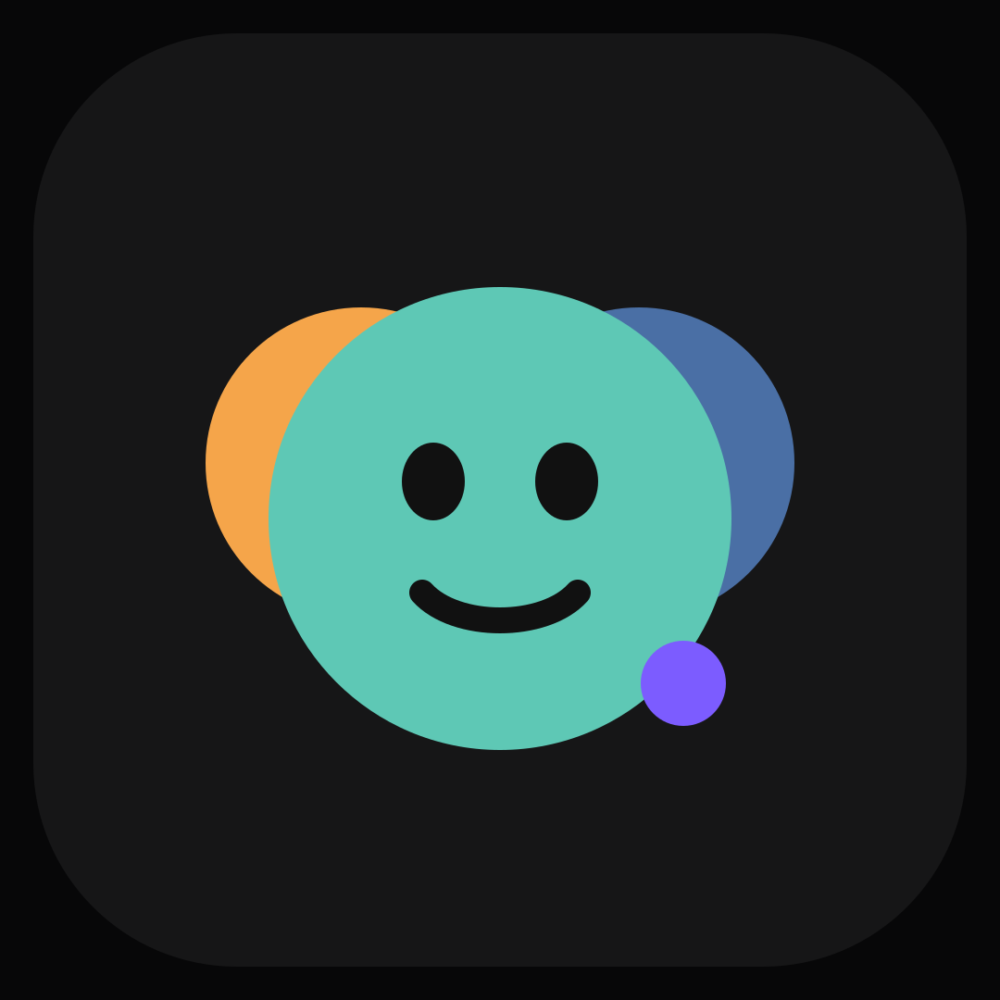
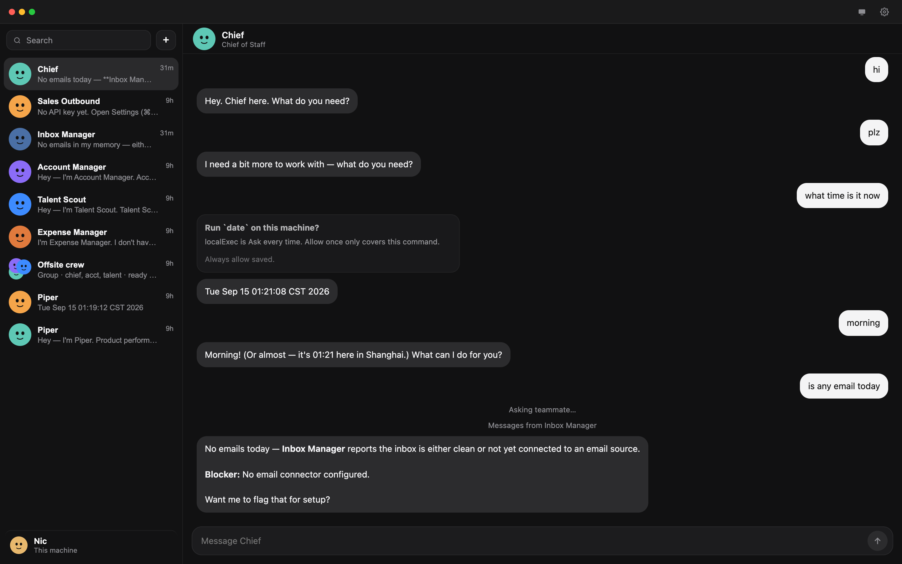
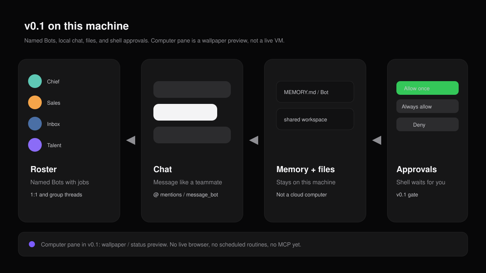

# OpenGrokBot



[English](README.md) · [中文](README.zh-CN.md)

**AI teammates that finish the work — on your machine.**

Message Bots like teammates. Give one a job, keep it around, add another when the work grows. They remember how you work, hand off to each other, and come back when something needs your approval.

OpenGrokBot is the open-source **[Grok Bot](https://x.ai/bot) alternative**. Same product shape. Same primitives. Your computer instead of theirs.



> Unofficial community project for learning. Not affiliated with xAI, Grok, or Cursor. See [Disclaimer](#disclaimer).

## How to use

You bring your own model. OpenGrokBot does not ship one. Point it at local **Ollama** (`/v1`) or any **OpenAI-compatible API** (DeepSeek, OpenRouter, MiniMax-style endpoints, and the rest).

1. Install Node 20+ and [pnpm](https://pnpm.io).
2. Clone, install, start:

```bash
git clone https://github.com/nickylin/OpenGrokBot.git
cd OpenGrokBot
pnpm install
pnpm start
```

3. Open [http://127.0.0.1:3088](http://127.0.0.1:3088).
4. Settings → Models: paste Base URL, API key, and model. **Ollama:** Base URL like `http://127.0.0.1:11434/v1`. If that server does not check keys, a dummy key is fine.
5. Test connection.
6. Pick a Bot in the left roster and send a message.

Keys stay on this machine in `~/.opengrokbot/settings.json`. Do not commit them. Do not put them in a Bot description or chat.

Defaults bind to `127.0.0.1:3088`. Override with `OPENGROKBOT_HOST`, `OPENGROKBOT_PORT`, or `OPENGROKBOT_HOME`. `pnpm dev` watches files. `pnpm typecheck` runs `tsc --noEmit`.

## Same Bot. Your computer.

Official Grok Bot ([docs](https://docs.x.ai/grok-bot/overview)): named teammates with jobs and compounding context. Each one works a persistent computer — browser, filesystem, terminal — and messages you like iMessage, not like a chatbot dump.

| | Grok Bot | OpenGrokBot |
|---|---|---|
| What you talk to | Named Bots with jobs | Same |
| Sidebar | Bot roster, not chat history | Same |
| Computer | Cursor cloud VM, keeps running when the laptop sleeps | **Your machine.** Sleep stops work. That’s the trade. |
| Workspace | One `/workspace` for every Bot | One folder on disk, same sharing model |
| Model | Cursor / Grok picks | You bring any OpenAI-compatible API |
| Setup | A message, not a workflow builder | Same |
| Price | Cursor / SuperGrok plan | Free. MIT |

## What v0.1 ships

This is a working local app, not a README stub.

**In this release**

- Named roster plus Create a Bot
- 1:1 and group threads
- `@` mentions and `message_bot` handoffs
- Per-Bot markdown memory and a shared workspace on disk
- Shell commands behind Allow once / Always allow / Deny
- Settings for any OpenAI-compatible API (DeepSeek, OpenRouter, local vLLM / Ollama `/v1`, …)
- Computer pane as a status preview, not a live VM

**Not yet**

- Real browser / computer-use
- Scheduled routines (shown on the Bot, not fired)
- MCP connectors
- Auto-review model
- Work while the laptop sleeps

The rest of the official list below is the north star, not a claim that every item is wired today.



## Where this is going (the official list)

**Message Bots like teammates.** Create a Bot, describe the job in a sentence, start talking. Chief of Staff, Sales Outbound, Inbox, Account Manager, Talent Scout — focused Bots beat a General Helper.

**Work with many Bots at once.** They run in parallel. Put 2–6 in a group thread and they pass work with `message_bot`. You are not the router.

**Come back when approval is needed.** Outbound, publish, pay, shell: Allow once / Always allow / Deny. A yes covers that action, not the past.

**Context compounds.** Each Bot keeps its own memory, thread, and routines. Files, cookies, and logins sit on the shared computer so handoffs don’t mean re-login.

**Show a Bot how it’s done.** Walk it through once, save a Skill, pin a Routine on that Bot. The schedule belongs to the teammate, not to a random cron tab.

**The computer has three levels.** Purple status by default. Pin a preview of its screen. Take over only for password / 2FA / CAPTCHA, then hand it back. You never type secrets into chat.

**Connectors first, computer-use when you must.** MCP and APIs where they exist; the local browser profile when they don’t. All Bots share that profile — one user, one browser — matching official isolation (between users, not between Bots).

## A good first handoff

Same prompt the official docs start with:

> Pull this week’s pipeline review list. Skip anyone already in an active sequence. Research the top five accounts, draft outreach in my voice, and leave me drafts to approve by tomorrow morning.

Tell it what to do, where to work, what finished looks like. Correct it. Turn the stable path into a routine — when the scheduler exists.

## The one thing we will not copy

Official Bots keep working when your laptop is closed. That needs their cloud computer.

OpenGrokBot runs on the host OS. Close the lid, the team stops. In exchange: no $120–300/month seat, no logins sitting in someone else’s VM, no waiting on a Bot API that does not exist.

If you need 24/7, keep a small machine awake — or stay on official Grok Bot.

## Data on this machine

| Path | What |
|---|---|
| `~/.opengrokbot/settings.json` | API key, models, paths |
| `~/.opengrokbot/bots/` | Roster YAML (seeded from `data/bots/` on first run) |
| `~/.opengrokbot/transcripts/` | Chat history |
| `~/.opengrokbot/memory/` | Per-Bot `MEMORY.md` |
| `~/.opengrokbot/workspace/` | Shared files the Bots can read and write |

License: [MIT](LICENSE).

## Disclaimer

OpenGrokBot is an independent, unofficial **open-source learning project**. It is not a product of xAI, Grok, or Cursor, and it is not endorsed, sponsored, or certified by them.

**Grok**, **Grok Bot**, **xAI**, and **Cursor** are trademarks or product names of their respective owners. We use those names only to describe what this project studies and how it differs. We do not claim any right in those marks, and **we are not the same company**.

This repository does not provide access to official Grok Bot, Cursor accounts, or xAI cloud computers. Anything you run here is on your own hardware, with keys you bring, at your own risk.
