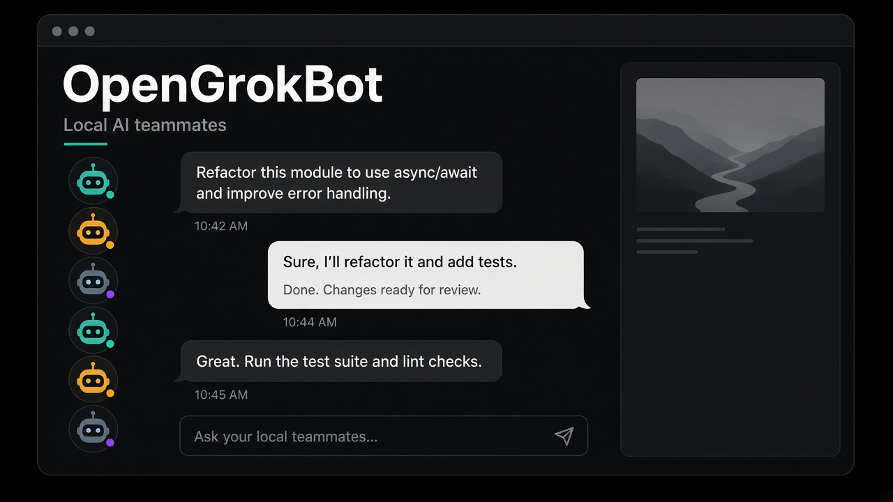

# OpenGrokBot


[English](README.md) · [中文](README.zh-CN.md)

**能把活干完的 AI 同事——跑在你自己的电脑上。**

像给同事派活一样给 Bot 发消息。给一个岗位、把它留下、活变多了再加一个。它们记得你怎么干活，会互相交接，卡住了才回来找你批。

OpenGrokBot 是开源的 **[Grok Bot](https://x.ai/bot) 平替**。同一套产品形态，同一套原语。用你的电脑，不用他们的云电脑。



> 非官方社区项目，以学习为主。与 xAI、Grok、Cursor 不是一家。详见[免责声明](#免责声明)。

## 如何使用

模型自己带。OpenGrokBot 不内置模型。可以接本机 **Ollama**（`/v1`），或任何 **OpenAI 兼容接口**（DeepSeek、OpenRouter、以及同类 endpoint）。

1. 安装 Node 20+ 和 [pnpm](https://pnpm.io)。
2. 克隆，安装，启动：

```bash
git clone https://github.com/nickylin/OpenGrokBot.git
cd OpenGrokBot
pnpm install
pnpm start
```

3. 打开 [http://127.0.0.1:3088](http://127.0.0.1:3088)。
4. Settings → Models：填 Base URL、API key、model。**Ollama：** Base URL 类似 `http://127.0.0.1:11434/v1`。如果服务端不校验 key，占位 key 即可。
5. 先 Test connection。
6. 左边花名册里点一个 Bot，发一条消息。

密钥只留在这台机器的 `~/.opengrokbot/settings.json`。不要提交，不要写进 Bot 描述或聊天。

默认绑在 `127.0.0.1:3088`。可用 `OPENGROKBOT_HOST`、`OPENGROKBOT_PORT`、`OPENGROKBOT_HOME` 覆盖。`pnpm dev` 带文件监听。`pnpm typecheck` 跑 `tsc --noEmit`。

## 同一个 Bot，你的电脑


官方 Grok Bot（[文档](https://docs.x.ai/grok-bot/overview)）：有名字、有岗位、上下文会累积。每个 Bot 有一台持久电脑——浏览器、文件系统、终端——聊天像 iMessage，不是把草稿堆在对话框里。

| | Grok Bot | OpenGrokBot |
|---|---|---|
| 你在跟谁说话 | 有岗位的具名 Bot | 一样 |
| 侧栏 | Bot 花名册，不是聊天记录 | 一样 |
| 电脑 | Cursor 云电脑，合盖笔记本也继续跑 | **你的机器。** 休眠就停。这是唯一的取舍。 |
| 工作区 | 所有 Bot 共用一份 `/workspace` | 磁盘上一个目录，同一套共享模型 |
| 模型 | Cursor / Grok 指定 | 自备任何 OpenAI 兼容接口 |
| 上手 | 发一条消息，不是搭工作流编辑器 | 一样 |
| 价格 | Cursor / SuperGrok 订阅 | 免费。MIT |

## v0.1 实际有什么

这是能跑的本机应用，不再是只有 README。

**这个版本有**

- 具名花名册，可以新建 Bot
- 1:1 和群聊
- `@` 提及和 `message_bot` 交接
- 每个 Bot 自己的 markdown 记忆，加一份磁盘上的共享工作区
- Shell 走 Allow once / Always allow / Deny
- 兼容 OpenAI 的接口设置（DeepSeek、OpenRouter、本机 vLLM / Ollama `/v1` 等）
- 电脑侧栏是状态预览，不是活的虚拟机

**还没有**

- 真浏览器 / computer-use
- 定时 Routine（能看见，不会到点跑）
- MCP 连接器
- Auto Review 模型
- 合上笔记本还继续干活

下面官方清单是方向，不是「今天每一项都接好了」。


## 往哪走（对照官方介绍）

**像给同事发消息。** 新建一个 Bot，一句话写清岗位，开始聊。Chief of Staff、Sales Outbound、Inbox、Account Manager、Talent Scout——聚焦的 Bot 比 General Helper 更能攒上下文。

**同时用很多个 Bot。** 它们并行干活。2–6 个放进一个群，用 `message_bot` 交接。你不是路由器。

**需要批准才回来找你。** 外发、发布、付钱、跑 shell：Allow once / Always allow / Deny。批准只覆盖这一次动作，不撤销已经做完的。

**上下文会累积。** 每个 Bot 自己的记忆、会话、Routine。文件、Cookie、登录在共用电脑上，交接不用重新登录。

**做一遍，它就会了。** 带着走完一次，存成 Skill，把 Routine 钉在这个 Bot 上。日程属于这名同事，不是随便一条 cron。

**电脑分三级。** 默认只亮紫色状态。可以钉住屏幕预览。密码 / 2FA / CAPTCHA 才接管，做完交回去。密钥不进聊天。

**能接连接器就接，不行再用电脑。** 有 MCP / API 走接口；没有就用本机独立浏览器配置。所有 Bot 共享这份配置——一用户一浏览器——隔离在用户之间，不在 Bot 之间，和官方一致。

## 第一次这样交出去

官方文档用的就是这句：

> 把这周的 pipeline 名单拉下来。已经在跟进的跳过。研究前五个客户，用我的口吻起草触达，明早之前把草稿留给我批。

说清干什么、在哪干、怎样算完。改一次，等调度接上再把稳定流程存成 Routine。

## 唯一不抄的那一项

官方 Bot 合上笔记本也继续跑。那需要他们的云电脑。

OpenGrokBot 跑在本机系统上。合盖，团队就停。换来的是：不用每月 $120–300 的席位，登录不放进别人的虚拟机，也不用等一个并不存在的公开 Bot API。

若必须 24/7，留一台小机器不休眠——或者继续用官方 Grok Bot。

## 数据在这台机器上

| 路径 | 内容 |
|---|---|
| `~/.opengrokbot/settings.json` | API key、模型、路径 |
| `~/.opengrokbot/bots/` | 花名册 YAML（首次从 `data/bots/` 拷贝） |
| `~/.opengrokbot/transcripts/` | 聊天记录 |
| `~/.opengrokbot/memory/` | 每个 Bot 一份 `MEMORY.md` |
| `~/.opengrokbot/workspace/` | Bot 可读写的共享文件 |

许可证：[MIT](LICENSE)。

## 免责声明

OpenGrokBot 是独立的、非官方的**开源学习项目**。它不是 xAI、Grok 或 Cursor 的产品，也未获得上述主体的认可、赞助或认证。

**Grok**、**Grok Bot**、**xAI**、**Cursor** 均为其权利人的商标或产品名称。本文仅用这些名称说明本项目在研究什么、以及和官方有何不同。我们不主张这些标识的任何权利，**和官方不是一家公司**。

本仓库不提供官方 Grok Bot、Cursor 账号或 xAI 云电脑。你在这里跑的一切都在自己的硬件上，用自己的密钥，风险自负。
